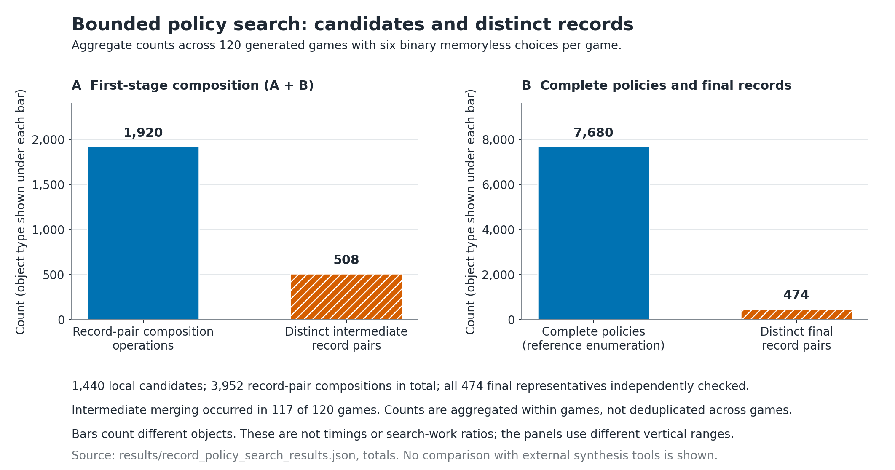
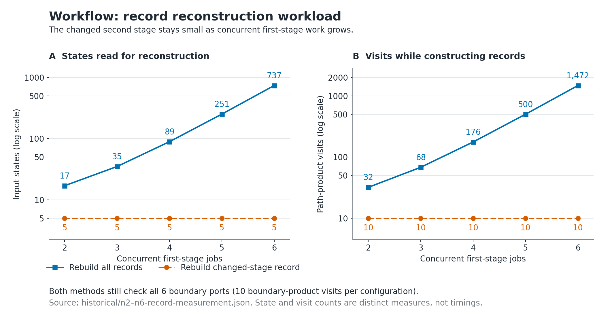
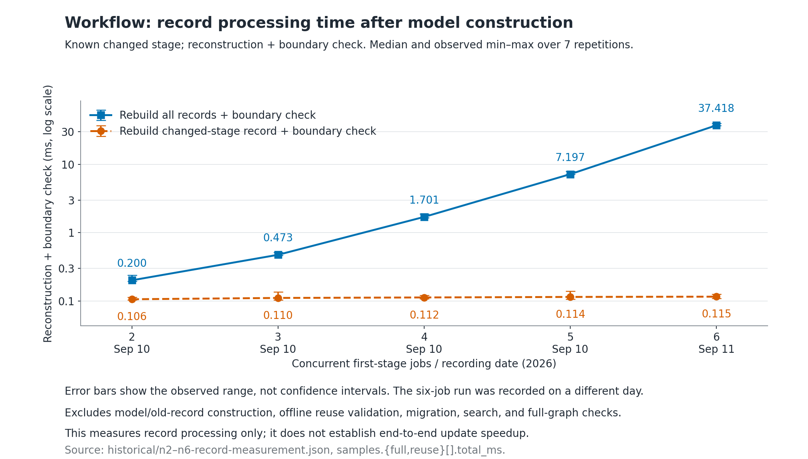
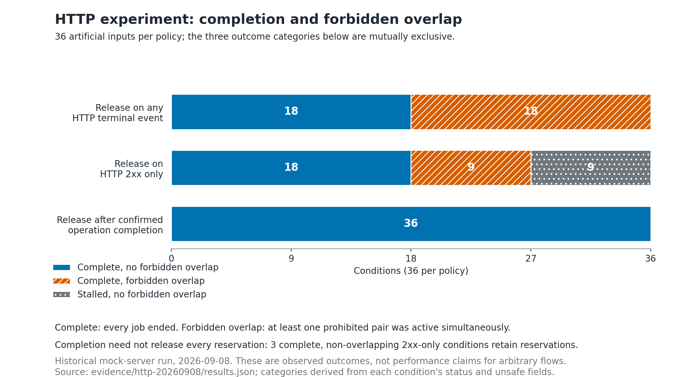

# Progress Certificate Reuse

Reproducible **preliminary experiments** on records at component boundaries,
checking safety, conditional completion, and nonconflictingness during
controller updates. The repository also includes a separate Node-RED HTTP
experiment on observing the completion of asynchronous operations.

The experiments investigate a practical question: **can a controller change be
checked by rebuilding records for the changed region, while preserving the
behavioral guarantees of the connected system?** The results support this
approach for the finite models studied here and identify completion observation
as a separate requirement for connecting the model to asynchronous execution.
The [experimental report](#experimental-report) below presents the measurements,
negative controls, and the scope of these conclusions.

## Experiments and evidence

| Study | Checked scope | Location |
|---|---|---|
| Fixed-policy record composition | 5,000 generated graph triples; 20,000 record-equality checks and 20,720 start-state checks agree with direct reconstruction/full-state checking | [Core protocol](docs/EXPERIMENTS.md), [archived results](results/SUMMARY.json) |
| Bounded memoryless policy search | 120 games, 7,680 complete policies, and 474 record representatives agree; 5 games realizable and 115 unrealizable in this bounded class | [Search implementation](experiments/validate_policy_search.py), [results](results/record_policy_search_results.json) |
| Workflow-derived models | New-version one-order fragments range from 17 to 737 states; re-recording the changed stage and checking all connections agrees with full reconstruction | [Workflow experiment](experiments/workflow/README.md) |
| Standard HTTP Request node | 36 artificial inputs × 3 methods; replay of 108 recorded conditions agrees with the original aggregate results | [HTTP experiments and trace replay](experiments/async-interface-contracts/README.md) |

The first two studies use generated finite graphs. The Workflow study uses a
model from the separate
[Fine-Grained Dynamic Controller Update via On-the-Fly Synthesis artifact](https://github.com/iTaku3/Fine-Grained-Dynamic-Controller-Update-via-On-the-Fly-Synthesis),
pinned to commit `cce6bf2204cda4396800217d23a9a57a5777aadf`.
That repository is the source of the model and MTSA tool, while this repository
contains the additional record-reuse experiments.

## Experimental report

### Study design and evidence

The report uses the measurements and execution histories checked into this
repository. The core and Workflow experiments were carried out on September
10–11, 2026; the HTTP study was carried out on September 8. Publication checks
on September 16 reproduced the core results, replayed all five Workflow
configurations, rebuilt the smallest Workflow configuration with MTSA, and
reran the HTTP and auxiliary experiments. These are replications of the same
inputs, not additional independent samples. The graphs use the historical
core, Workflow, and HTTP records; the auxiliary finite-model and observation
results below refer to the separately identified September 16 replication.

The experiments address three linked questions:

1. **Faithfulness:** do boundary records retain enough information to recover
   the same safety, conditional-completion, and nonconflictingness verdicts as
   direct checking?
2. **Reuse:** can unchanged regions retain their records while a changed region
   is reconstructed and every connection is checked again?
3. **Execution interface:** which observations distinguish an accepted HTTP
   request from an operation that has actually finished?

The first two questions are evaluated on finite graphs under explicit modeling
assumptions. The third is evaluated with the actual standard Node-RED HTTP
Request node and a local synthetic server. The HTTP experiment is a separate
study of the execution interface; these components have not yet been combined
into an end-to-end update system.

### 1. Boundary records agree with direct checking

The fixed-policy study generated 5,000 triples of components using seed
`20260910`. Each component has 3–10 states and 1–4 boundary ports. The generator
covers 0, 1, 2, and 3 `GF` justice assumptions equally, with 1,250 triples in each
category. A `GF` assumption requires a designated condition to recur infinitely
often. Completion states are absorbing, and cross-component edges enter only
at declared boundary ports.

For every triple, the checker compared both flat composition and nested
composition with a record reconstructed from the complete graph. It did this
for normal records and completion-avoiding records, then compared all selected
starting states against a full-state reference checker.

| Check | Comparisons | Observed disagreements |
|---|---:|---:|
| Flat/nested record composition against direct reconstruction | 20,000 | 0 |
| Three-property verdicts at selected starting states | 20,720 | 0 |
| Individual safety/completion/nonconflictingness verdicts | 62,160 | 0 |

The last row is the three properties in the preceding row, not a separate set
of test cases. The full-state reference does not consume cached records and
uses a different SCC computation; the implementations still share the same
mathematical modeling assumptions.

The negative cases explain why the record needs more than a successful exit:

- In **4,541 of the 20,720 starting-state checks**, safety and conditional
  completion hold while nonconflictingness fails. A controller can satisfy a
  conditional requirement by leaving the environment unable to fulfill its
  assumptions. The three-property check exposes these cases.
- The [three-state trapped-branch example](results/exit_set_counterexample.json)
  has one completed branch and one branch with no fair continuation. Keeping
  the empty exit obligation rejects the trapped branch; deliberately removing
  it produces a false acceptance of nonconflictingness.
- Two attempts to introduce unrecorded boundary entries are rejected.
- The [request-transfer example](results/transfer_example_result.json) shows
  that a completed software switch can still lose an accepted request.
  Preserving the external request obligation makes this error visible to the
  completion check.

**What this establishes.** Within the generated class, the implementation
retains both favorable and unfavorable behavior through composition and hiding
of intermediate ports. The negative controls demonstrate a concrete reason for
tracking exit obligations and request completion. The frequencies above describe
this generator, not the prevalence of such errors in deployed systems.

Source: [full composition results](results/record_composition_results.json),
[protocol](docs/EXPERIMENTS.md), and [record semantics](docs/SEMANTICS.md).

### 2. Record equivalence supports bounded policy search

The search study uses 120 generated games with 18 states each, seed
`2026091027`, and six binary memoryless control choices per game. All legal
environment choices are retained. This gives 64 complete policies per game and
7,680 policies across the study. Candidate records are composed in stages;
equal pairs of normal and completion-avoiding records are merged.



*Figure 1. Counts aggregated across the 120 games. Candidate combinations,
complete policies, and record classes are different objects; the bars describe
representation and aggregation, not measured computational cost.*

| Search quantity | Total across 120 games |
|---|---:|
| Initial local candidates | 1,440 |
| First-stage record-pair combinations | 1,920 |
| Distinct intermediate record pairs | 508 |
| Record-pair compositions across both stages | 3,952 |
| Complete policies examined by the reference enumeration | 7,680 |
| Distinct final record pairs / independently checked representatives | 474 |
| Games with intermediate merging | 117 / 120 |
| Realizable / unrealizable games within the bounded class | 5 / 115 |

The set of final record classes matched exhaustive enumeration in every game.
All 474 representative policies were reconstructed and checked independently;
their three-property verdicts and the bounded realizability decisions agreed.
The 474 classes are summed per game, not equivalence classes across unrelated
games. Each record-pair composition performs a normal and a completion-avoiding
composition. Local candidate enumeration and initial record construction also
have costs.

**What this establishes.** Distinct control choices often share the same
boundary behavior, and the tested search retains the required distinctions
when merging them. This is evidence for a semantic basis for search reuse.
The ratio between 474 record classes and 7,680 policies is not a runtime speedup
or a reduction in total synthesis work. The 5 realizable games are an outcome
of the fixed generator, not a success rate for general controller synthesis.

Source: [bounded search results](results/record_policy_search_results.json).

### 3. Workflow updates isolate repeated work to the changed stage

The Workflow model describes order processing. The old controller permits
billing and shipping to overlap; the new controller waits for billing to finish
before starting shipping. MTSA first constructs both controlled behaviors.
The experiment then extracts one accepted order, ending at rejection or
archiving, and partitions it into a first stage, a changed second stage, and
terminal states. Parallel behavior within each stage is retained.

Increasing the number of first-stage jobs grows the unchanged part of the
model. The changed second stage has five states in every new-version episode.
For each configuration, the experiment compares rebuilding every component
record with retaining the old first-stage and terminal records and rebuilding
only the second-stage record. Both methods check all six boundary ports.



*Figure 2. Model states and internal path-product visits used in record
construction. A path-product visit is an implementation counter for exploring
paths with monitor information, not a unit of elapsed time. Boundary checking
adds 10 product visits in each configuration under both methods.*

| First-stage jobs | New episode states | States re-recorded with reuse | Full record path-product visits | Recreated record path-product visits | Boundary product visits |
|---:|---:|---:|---:|---:|---:|
| 2 | 17 | 5 | 32 | 10 | 10 |
| 3 | 35 | 5 | 68 | 10 | 10 |
| 4 | 89 | 5 | 176 | 10 | 10 |
| 5 | 251 | 5 | 500 | 10 | 10 |
| 6 | 737 | 5 | 1,472 | 10 | 10 |

In every row, record-only composition and direct checking agree on all three
properties, and local reconstruction produces the same composed records as
full reconstruction. Removing the archiving connector is detected as a
nonconflictingness failure in every configuration. Thus the observed reuse
keeps the global connection check in place. The extracted Workflow episodes
designate no unsafe states, so their safety verdict is vacuous; this experiment
primarily probes record equivalence, conditional completion, and
nonconflictingness. The randomized core study separately includes unsafe states.

At six jobs, **5 of 737 states are re-recorded**, a 99.32% reduction in the number
of states supplied to repeated record construction for this change. The other
732 states contribute records that were built earlier and verified unchanged.
That verification is performed offline before timing, using a full set of
new-version records. The timed reuse phase receives retained records and a
known changed stage; it does not discover which records are reusable.
This is a measurement of work avoided after construction, not a reduction in
the size of the original synthesis problem.

#### Measured record-processing time

The historical measurements used a MacBook Air with 24 GB of memory while
other desktop applications were active. Each method received one warm-up run,
then seven measured runs with alternating order. The measured phase includes
record construction plus composition and boundary-property checking. Input
reading, initial MTSA construction, initial old-record construction, offline
verification of unchanged records, state-transfer checking, candidate search,
and full-graph reference validation are outside the timed phase. Automatic
dependency discovery is not implemented or measured.



*Figure 3. Milliseconds on a logarithmic vertical axis; points are medians and
whiskers span the seven observed runs, not confidence intervals. The 2–5-job
measurements are from September 10 and the 6-job measurement is from September
11. The plotted phase excludes initial model construction.*

| Jobs | Full record phase, median ms | Reuse record phase, median ms | Ratio of phase medians |
|---:|---:|---:|---:|
| 2 | 0.2004 | 0.1057 | 1.90× |
| 3 | 0.4735 | 0.1104 | 4.29× |
| 4 | 1.7009 | 0.1123 | 15.15× |
| 5 | 7.1967 | 0.1142 | 63.01× |
| 6 | 37.4181 | 0.1153 | 324.55× |

The ratio is calculated from unrounded medians and applies **only to the
measured record-processing phase**. For the largest constructed case, full
processing ranged from 37.2080 to 39.8246 ms; reuse ranged from 0.1094 to
0.1247 ms. Reuse stayed close to the cost of re-recording the same five-state
stage and checking the fixed interface as the unchanged first stage grew.

Initial model construction remains a separate bottleneck. The successful
six-job old/new MTSA constructions took 141.254 and 140.305 seconds. With a
2 GB heap limit and 90-second timeout, both six- and seven-job constructions
had timed out. With an 8 GB heap limit and a 300-second timeout, six jobs
completed, but both seven-job constructions still timed out. These failures
are retained in the [September 10](experiments/workflow/historical/2026-09-10-native-exports.json)
and [September 11](experiments/workflow/historical/2026-09-11-native-exports.json)
logs. Both resource limits changed, so success cannot be attributed to memory
alone; a timeout is not evidence of an out-of-memory failure.

**What this establishes.** For this fixed partition and localized update,
repeated record processing can depend primarily on the changed stage and its
interface even as the unchanged region grows. This identifies a useful target
for updates after model construction. It does not demonstrate a reduction in
the dominant cost of initial MTSA construction or an end-to-end update speedup.
The partition and changed region were provided explicitly; automatic discovery
and invalidation remain research tasks.

Source: [Workflow protocol and provenance](experiments/workflow/README.md),
[five historical measurements](experiments/workflow/historical/), and
[publication-time validation](experiments/workflow/VALIDATION.json).

### 4. HTTP responses do not substitute for effect completion

The execution study runs the standard Node-RED HTTP Request node using the
official test helper and a local mock server. Its 36 artificial inputs include
12 cases where HTTP 200 follows effect completion, 12 with early HTTP 202
acceptance, and 12 where the client times out while server-side work can
continue. Each input is run under three reservation-release rules, producing
108 conditions.



*Figure 4. Each bar contains the same 36 inputs. Categories are derived jointly
from each recorded condition's completion status and forbidden-overlap flag.
Completion alone does not imply safety or that every reservation was released.*

| Reservation-release rule | Complete, no forbidden overlap | Complete, forbidden overlap | Stalled | Conditions with reservations remaining |
|---|---:|---:|---:|---:|
| Release on any HTTP terminal output | 18 | 18 | 0 | 0 |
| Release only on HTTP 2xx | 18 | 9 | 9 | 12 |
| Release after operation-status confirmation | 36 | 0 | 0 | 0 |

The first three outcome columns form a partition of the 36 inputs. The last
column is a separate measure that can overlap with a completed or stalled
condition. In the 2xx-only rule, three completed conditions still retain
reservations, in addition to the nine stalled conditions. It counts conditions
with retained reservations, not the number of retained reservations.

Releasing on any terminal output finishes every workload but permits forbidden
overlap in half of the inputs. Releasing only on 2xx avoids some unsafe releases
but still treats early acceptance as completion and can leave unsent jobs
stalled after timeouts. Querying the true operation status completes all 36
inputs without forbidden overlap or remaining reservations.

An independent Python program replays dispatch, server acceptance, effect
start/end, HTTP termination, status observation, and reservation-release
events. All 108 historical conditions have zero replay disagreements; the
September 16 rerun has the same aggregate outcomes and also zero replay
disagreements. Input, experiment source, dependency lockfile, and standard
HTTP-node hashes are verified. Both local runs used Node.js 26.3.0 and Node-RED
5.0.6; the GitHub Actions workflow additionally exercises Node.js 22.

**What this establishes.** The observations available at the execution boundary
change whether an apparently completed request is safe to treat as finished.
The experiment supplies concrete counterexamples and a working reference
interface based on operation identifiers and true completion. It assumes a
reliable status source on a local synthetic server; it does not establish
correctness under notification loss, arbitrary service behavior, or general
Node-RED deployment.

Source: [historical traces and summary](experiments/async-interface-contracts/evidence/http-20260908/),
[publication replication](experiments/async-interface-contracts/evidence/verification-20260916/http/),
and [replay implementation](experiments/async-interface-contracts/src/node-red-lab/replay_http.py).

#### Supporting finite-model and observation-selection studies

Two companion checks clarify the assumptions behind the HTTP reference design:

- **Reservation lifetime:** the September 16 replication covers 89 parameter
  points representing 80 distinct labeled finite inputs. Reserving until true
  completion has zero admission-decision disagreements with the full-game
  reference across all winning states. In these inputs it has no reachable
  unsafe states or deadlocks, and a fully completed state is reachable in all
  89 cases. It allows greater maximum reachable concurrency than global
  serialization in 79 cases. These are model results; reachability of completion
  is not a claim that every run completes.
- **Completion-observation selection:** 60 distinct inputs and all their
  observation subsets yield 8,180 conditions. The covering criterion and the
  finite-game checker agree in every condition: 3,027 feasible and 5,153
  infeasible, with zero invalid reconstructed policies. The criterion applies
  to one-shot independent jobs with finite but unknown execution times and
  reliable completion observations. Every forbidden simultaneous-execution
  set must contain an observed job. Repeated jobs, precedence constraints,
  cancellation, and lost notifications require additional analysis.

These checks use established reservation and covering ideas as reference
methods. Their role is to make interface assumptions and counterexamples
executable, rather than to claim new general results about those methods.
See the [finite-model results](experiments/async-interface-contracts/evidence/verification-20260916/finite-state/summary.json)
and [observation-selection results](experiments/async-interface-contracts/evidence/verification-20260916/interface-selection/summary.json).

### Research value and remaining work

Together, the studies provide three concrete contributions at the prototype
stage: a boundary representation that survives extensive finite comparison
including adverse cases; an executable demonstration that a localized change
can reuse unchanged records while retaining the full connection check; and an
execution experiment showing which completion observations the model must
account for. The result is a reproducible basis for testing a more general
update method, with failure cases and resource limits retained alongside
successful outcomes.

The main validity boundaries are finite generated inputs, one Workflow family,
a manually supplied partition, a single local timing environment, and
synthetic HTTP workloads. Policy memory and parallel behavior are already
expanded into graph states; the search experiment is memoryless. No comparison with competing synthesis tools has
been performed. General state migration, finite-memory synthesis, automatic
dependency invalidation, and integrated end-to-end update performance remain
open tasks. Further evaluation should vary interface size, assumption count,
update extent, and model family, and include initial construction and failed
runs in total update cost.

### Regenerate the report figures

The figures are generated directly from the checked-in JSON files by
[`scripts/plot_results.py`](scripts/plot_results.py). Their source hashes and
plotted values are recorded in [`plot-data.json`](docs/figures/plot-data.json).
PNG previews and scalable SVG versions are available in
[`docs/figures/`](docs/figures/). Figure regeneration does not rerun experiments
or modify the archived evidence.

With Python 3.10 or newer, run the following from the repository root on
macOS or Linux. Matplotlib is an optional reporting dependency; the core
experiments still require only the Python standard library.

```sh
python3 -m venv .venv-figures
.venv-figures/bin/python -m pip install -r requirements-figures.txt
.venv-figures/bin/python scripts/plot_results.py
```

## Reproduce the core checks

Python 3.10 or newer is sufficient; the core checks use only the standard
library and do not access the network.

```sh
git clone https://github.com/iTaku3/progress-certificate-reuse.git
cd progress-certificate-reuse
python3 reproduce.py
```

Fresh results go to `outputs/core/`. The runner executes unchanged copies of
the experiment code in a temporary directory and checks the main totals against
the archived `results/SUMMARY.json`. The archived results are preserved.
To choose another output directory:

```sh
python3 reproduce.py --output-dir outputs/my-core-run
```

The following original commands are also available. They **replace their
corresponding archived files in `results/`**, so use a disposable checkout if
running them directly:

```sh
python3 examples/transfer.py
python3 examples/exit_sets.py
python3 experiments/validate_composition.py --cases 5000 --seed 20260910
python3 experiments/validate_policy_search.py
```

For model acquisition, Java/MTSA export, and record reconstruction, follow the
[Workflow instructions](experiments/workflow/README.md). For Node.js dependencies,
HTTP execution, and independent trace replay, follow the
[HTTP instructions](experiments/async-interface-contracts/README.md). Neither
additional study is run by the core `reproduce.py` command.

## What a record retains

Under a fixed policy, the environment may still choose among legal transitions.
Environment assumptions are conjunctions of `GF J_i` conditions, and completion
states are absorbing. At each boundary entry, a record retains:

1. Paths to other boundary ports and the monitor conditions seen along them.
2. Reachable internal fair cycles and reachable unsafe states.
3. Minimal families of exit sets for internal states that cannot satisfy all
   assumptions while remaining within the component.

Every exit-set obligation from every reachable entry must be satisfied. The
empty exit set matters: it represents a trapped internal branch. Both normal
records and records with completion states removed are needed to check
completion. The [semantics](docs/SEMANTICS.md) describe the three properties.

The composition function inspects records and connector edges. Initial record
construction still inspects internal graphs, and its cost can grow
exponentially with the number of ports or assumptions. New boundary entries
require reconstruction.

## Provenance and license

The core experiments were performed on 2026-09-10 and packaged on 2026-09-11;
the combined publication was prepared on 2026-09-16. Each additional study
keeps its own historical results, reproduction instructions, and provenance.
See [core provenance](PROVENANCE.json) and the subdirectory READMEs.
The [publication validation report](VALIDATION.json) summarizes the local
checks performed before publication. GitHub Actions reruns the core and HTTP
studies; the Workflow study requires the separately acquired MTSA jar.

Original code in this repository is distributed under the [MIT license](LICENSE).
Third-party models and the MTSA executable are acquired separately from their
upstream distribution; their original terms apply. Node-RED and its test helper
are installed through the pinned npm dependency lockfile and retain their own
licenses. No third-party model, MTSA binary, or installed npm dependency tree
is bundled in this repository.
