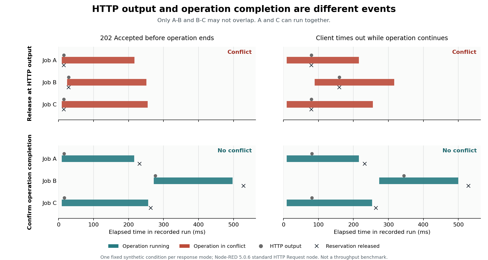

# Async interface contracts: reference experiments

非同期部品のHTTP応答と処理の終了を区別し、安全な操作の許可に必要な完了観測を調べる研究用の参照実装です。実験結果を再現するための小規模パッケージで、一般のNode-REDフローの検証器ではありません。

## 3つの実験

| 実験 | 確認すること | 確認済みの範囲 |
|---|---|---|
| 有限状態モデル | 送出から完了まで予約する基準方式と全状態ゲームの一致 | 89パラメータ点（内容が異なるラベル付き入力80件） |
| 標準HTTP Request | 受付応答／タイムアウト後にも相手の処理が継続する例 | 36入力×3方式、108条件 |
| 完了観測の選定 | 一回限りのジョブを全て実行するために必要な観測対象 | 60入力×全観測部分集合、8,180条件 |

予約、状態照会、被覆問題、有限ゲームは既知の方法です。このパッケージ自体を新しい合成理論の実証とは位置づけません。研究の出発点として、成立する仮定、反例、比較基準を明確にします。

## 実行

Python 3.9以上を使う2実験は追加ライブラリ不要です。この実験フォルダ（`experiments/async-interface-contracts/`）で実行します。

```sh
mkdir -p outputs
python3 src/finite-state/experiment.py --output outputs/finite-state
python3 src/interface-selection/experiment.py --output outputs/interface-selection
```

HTTP実験にはNode.js 22.9以上とnpmが必要です。標準ノードを公式test-helperで実行し、接続先は同じプロセス内のループバック模擬サーバだけです。

```sh
cd src/node-red-lab
mkdir -p ../../outputs
npm ci --ignore-scripts --no-audit --no-fund --cache .npm-cache
node http_experiment.cjs --output ../../outputs/http
python3 replay_http.py ../../outputs/http
```

短い動作確認には、出力先を変えて`--input-id path3_accept_202_1`を付けると、1入力を3方式で実行します。これは全108条件の再現とは区別してください。

HTTP実験は実装フォルダを作業ディレクトリにしてください。すべての実験で、新しい出力先を使います。`--enforce-deadline`は元の調査日の11:00 JST停止用で、後日の再現には付けません。CPUや環境によって所要時間・実測時刻は変わります。



## 結果の読み方

HTTPの成功／エラー出力で予約を解放する方式は18/36で競合違反、2xxだけで解放する方式は9/36で違反・9/36で未送信ジョブの停滞がありました。操作IDの真の完了を照会する方式は36/36完了、違反0、保持予約0。108条件の記録を別のPythonプログラムで再生し、集計の不一致は0でした。

観測点選定は、一回限り・独立・有限かつ上限未知の実行時間・信頼できる終了通知という前提で、禁止される同時実行集合を観測対象が覆う条件と一致しました。繰返し実行、先行制約、通知消失にはそのまま使えません。詳しくは[対象クラスと限定命題](docs/completion-observation-scope.md)。

`examples/`に集計と固定例の実測記録を置いています。数値は人工的な入力での準備結果です。実機、外部サービス、実運用の性能、既存CNT・RoboSCの不具合を実証していません。

## 関連する一次資料

- [Node-REDの非同期メッセージ配送](https://nodered.org/blog/2019/08/16/going-async)
- [ROS2のAction取消しと完了の区別](https://design.ros2.org/articles/actions.html)
- [Networked Supervisory Control Synthesis](https://arxiv.org/abs/2102.09255)
- [RoboSC](https://doi.org/10.1109/ICRA48891.2023.10161436)

2026-09-08作成、2026-09-16公開用検証。著者は Takuto Yamauchi。独自の実験コードと資料にはリポジトリルートの[MIT License](../../LICENSE)を適用します。Node-REDとtest-helperは`package-lock.json`でバージョンを固定した外部依存です。それぞれのライセンスが適用され、依存コード自体はこのリポジトリに同梱しません。論文PDF、第三者モデル、CIF本体も含めていません。

## 収録記録と公開時の再検証

- [`evidence/http-20260908/`](evidence/http-20260908/) は、上記HTTP集計の根拠となる2026-09-08の全108条件です。`results.json`と入力、当時の実験ソースは原記録と同一です。`manifest.json`のローカル絶対パスのみ持ち運び可能な表記に変更しました。
- [`evidence/verification-20260916/`](evidence/verification-20260916/) は、公開版から再実行した有限モデル89点、観測選定8,180条件、HTTP全108条件です。過去の実行とは別の記録です。HTTPの集計は過去の集計に一致し、新旧それぞれの108条件の独立再生で不一致0、入力・ソース・lockfile・HTTPノードのハッシュ検査は全て真でした。
- [`VALIDATION.json`](VALIDATION.json) は公開時の検査、[`MANIFEST.json`](MANIFEST.json) は収録物のハッシュ、[`PROVENANCE.json`](PROVENANCE.json) は公開用変更の記録です。`provenance/PREPARATION_*_20260908.json`内の未公開表示は2026-09-08時点の準備記録です。

新しいHTTP実行には上記コマンドを使います。収録済みの歴史的な全108条件を再生する場合は、依存インストール後に次を実行します（作業ディレクトリは`src/node-red-lab/`）。当時のソースはハッシュ検証用の保存物で、実行には現在の`src/`を使います。

```sh
python3 replay_http.py ../../evidence/http-20260908 \
  --source ../../evidence/http-20260908/http_experiment.cjs
python3 replay_http.py ../../evidence/verification-20260916/http
```

再生は指定フォルダ内の`independent_replay.json`を書き出します。`original_independent_replay.json`は当時の再生報告として別に保存しています。履歴再生だけならループバック接続も発生しません。
